# Data report overview
The dataset examined has the following dimensions:

---------------------------------
Feature                    Result
------------------------ --------
Number of observations       2664

Number of variables            36
---------------------------------

LSACGRK4

# Codebook summary table

-----------------------------------------------------------------------------------------
Label           Variable                   Class         # unique  Missing  Description  
                                                           values                        
--------------- -------------------------- ----------- ---------- --------- -------------
hic id          **[cid]**                  numeric           2664  0.00 %                
number                                                                                   

4/5 -           **[ses]**                  numeric           2653  0.23 %                
socioeconomic                                                                            
position                                                                                 

                **[geo]**                  character            3  0.11 %                

                **[gender]**               character            2  0.00 %                

                **[lang]**                 character            2  0.00 %                

                **[parent\_gender]**       character            2  0.00 %                

                **[indig]**                factor               3  0.60 %                

8/9 - School    **[y3\_grade]**            numeric              1  0.00 %                
- F2F D10 -                                                                              
Program type                                                                             

8/9 - State     **[y3\_state]**            numeric              8  0.00 %                
of residence                                                                             

8/9 -           **[y3\_weight]**           numeric           2640  0.00 %                
Population                                                                               
weight                                                                                   

Stratum         **[y3\_stratum]**          numeric             22  0.00 %                

                **[y3\_math.interest]**    ordered              4  0.71 %                

                **[y3\_math.judgement]**   ordered              6  0.60 %                

                **[y3\_read.interest]**    ordered              4  0.71 %                

                **[y3\_read.judgement]**   ordered              6  0.45 %                

10/11 -         **[y5\_grade]**            numeric              5  4.39 %                
School - F2F                                                                             
C4 - Program                                                                             
type                                                                                     

                **[y5\_math.interest]**    ordered              4  5.93 %                

                **[y5\_math.judgement]**   ordered              6  5.59 %                

                **[y5\_read.interest]**    ordered              4  5.93 %                

                **[y5\_read.judgement]**   ordered              6  5.86 %                

                **[y7\_math.interest]**    ordered              4  10.81 %               

                **[y7\_math.judgement]**   ordered              6  11.04 %               

                **[y7\_read.interest]**    ordered              4  10.81 %               

                **[y7\_read.judgement]**   ordered              6  11.64 %               

naplan -        **[y3\_math]**             numeric             94  2.44 %                
year 3                                                                                   
numeracy                                                                                 

naplan -        **[y5\_math]**             numeric             76  5.74 %                
year 5                                                                                   
numeracy                                                                                 

naplan -        **[y7\_math]**             numeric             83  11.79 %               
year 7                                                                                   
numeracy                                                                                 

naplan -        **[y3\_read]**             numeric            105  2.52 %                
year 3 read                                                                              

naplan -        **[y5\_read]**             numeric             72  4.99 %                
year 5 read                                                                              

naplan -        **[y7\_read]**             numeric             61  11.56 %               
year 7 read                                                                              

naplan -        **[y3\_status]**           numeric              4  0.00 %                
year 3                                                                                   
status                                                                                   

naplan -        **[y5\_status]**           numeric              6  2.63 %                
year 5                                                                                   
status                                                                                   

naplan -        **[y7\_status]**           numeric              6  8.86 %                
year 7                                                                                   
status                                                                                   

School ID       **[y3\_sid]**              numeric           1639  0.00 %                

Year 3          **[y3\_math.sch]**         numeric             49  0.98 %                
Numeracy -                                                                               
School's                                                                                 
mean NAPLAN                                                                              
scale score                                                                              

Year 3          **[y3\_read.sch]**         numeric             50  0.94 %                
Reading -                                                                                
School's                                                                                 
mean NAPLAN                                                                              
scale score                                                                              
-----------------------------------------------------------------------------------------

# Variable list
## cid

*hic id number*

\bminione

-------------------------------------------------
Feature                                    Result
------------------------- -----------------------
Variable type                             numeric

Number of missing obs.                    0 (0 %)

Number of unique values                      2664

Median                                   72110974

1st and 3rd quartiles       61305894; 81115736.25

Min. and max.                  51101040; 88117433
-------------------------------------------------

\emini
\bminitwo
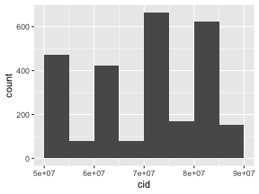

\emini

\fullline

## ses

*4/5 - socioeconomic position*

\bminione

---------------------------------------
Feature                          Result
------------------------- -------------
Variable type                   numeric

Number of missing obs.       6 (0.23 %)

Number of unique values            2652

Median                                0

1st and 3rd quartiles       -0.58; 0.85

Min. and max.                  -3.63; 3
---------------------------------------

\emini
\bminitwo
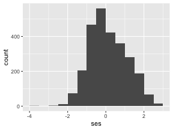

\emini

\fullline

## geo

\bminione

--------------------------------------
Feature                         Result
------------------------- ------------
Variable type                character

Number of missing obs.      3 (0.11 %)

Number of unique values              2

Mode                           "urban"
--------------------------------------

\emini
\bminitwo
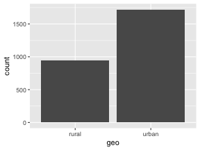

\emini

- Observed factor levels: \"rural\", \"urban\". 

\fullline

## gender

\bminione

-------------------------------------
Feature                        Result
------------------------- -----------
Variable type               character

Number of missing obs.        0 (0 %)

Number of unique values             2

Mode                            "boy"
-------------------------------------

\emini
\bminitwo
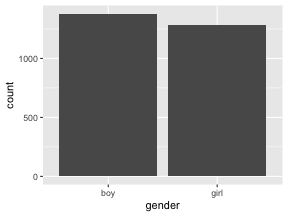

\emini

- Observed factor levels: \"boy\", \"girl\". 

\fullline

## lang

\bminione

-------------------------------------
Feature                        Result
------------------------- -----------
Variable type               character

Number of missing obs.        0 (0 %)

Number of unique values             2

Mode                            "eng"
-------------------------------------

\emini
\bminitwo
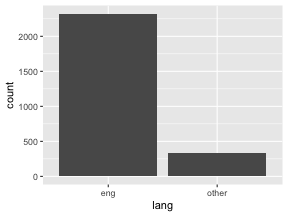

\emini

- Observed factor levels: \"eng\", \"other\". 

\fullline

## parent\_gender

\bminione

-------------------------------------
Feature                        Result
------------------------- -----------
Variable type               character

Number of missing obs.        0 (0 %)

Number of unique values             2

Mode                         "mother"
-------------------------------------

\emini
\bminitwo
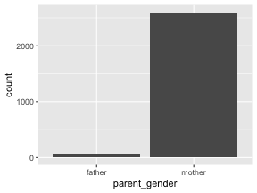

\emini

- Observed factor levels: \"father\", \"mother\". 

\fullline

## indig

\bminione

--------------------------------------
Feature                         Result
------------------------- ------------
Variable type                   factor

Number of missing obs.      16 (0.6 %)

Number of unique values              2

Mode                        "nonIndig"

Reference category               indig
--------------------------------------

\emini
\bminitwo
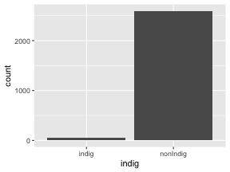

\emini

- Observed factor levels: \"indig\", \"nonIndig\". 

\fullline

## y3\_grade

*8/9 - School - F2F D10 - Program type*

* The variable only takes one (non-missing) value: \"19\". The variable contains 0 \% missing observations.

\fullline

## y3\_state

*8/9 - State of residence*

\bminione

-----------------------------------
Feature                      Result
------------------------- ---------
Variable type               numeric

Number of missing obs.      0 (0 %)

Number of unique values           8

Median                            2

1st and 3rd quartiles          1; 4

Min. and max.                  1; 8
-----------------------------------

\emini
\bminitwo
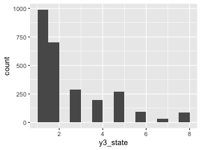

\emini

\fullline

## y3\_weight

*8/9 - Population weight*

\bminione

-----------------------------------------
Feature                            Result
------------------------- ---------------
Variable type                     numeric

Number of missing obs.            0 (0 %)

Number of unique values              2640

Median                              49.18

1st and 3rd quartiles        40.69; 67.03

Min. and max.               17.27; 150.47
-----------------------------------------

\emini
\bminitwo
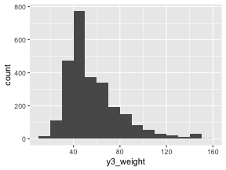

\emini

\fullline

## y3\_stratum

*Stratum*

\bminione

-----------------------------------
Feature                      Result
------------------------- ---------
Variable type               numeric

Number of missing obs.      0 (0 %)

Number of unique values          22

Median                           21

1st and 3rd quartiles        13; 41

Min. and max.                11; 81
-----------------------------------

\emini
\bminitwo
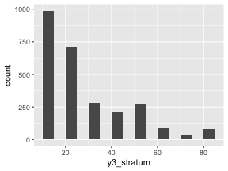

\emini

\fullline

## y3\_math.interest

\bminione

---------------------------------------
Feature                          Result
------------------------- -------------
Variable type                   ordered

Number of missing obs.      19 (0.71 %)

Number of unique values               3

Mode                                "3"

Reference category                    1
---------------------------------------

\emini
\bminitwo
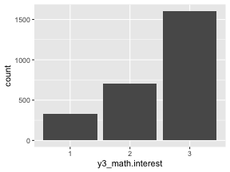

\emini

- Observed factor levels: \"1\", \"2\", \"3\". 

\fullline

## y3\_math.judgement

\bminione

--------------------------------------
Feature                         Result
------------------------- ------------
Variable type                  ordered

Number of missing obs.      16 (0.6 %)

Number of unique values              5

Mode                               "3"

Reference category                   1
--------------------------------------

\emini
\bminitwo
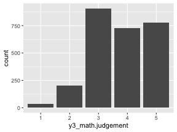

\emini

- Observed factor levels: \"1\", \"2\", \"3\", \"4\", \"5\". 

\fullline

## y3\_read.interest

\bminione

---------------------------------------
Feature                          Result
------------------------- -------------
Variable type                   ordered

Number of missing obs.      19 (0.71 %)

Number of unique values               3

Mode                                "3"

Reference category                    1
---------------------------------------

\emini
\bminitwo
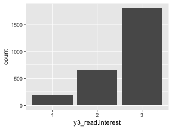

\emini

- Observed factor levels: \"1\", \"2\", \"3\". 

\fullline

## y3\_read.judgement

\bminione

---------------------------------------
Feature                          Result
------------------------- -------------
Variable type                   ordered

Number of missing obs.      12 (0.45 %)

Number of unique values               5

Mode                                "5"

Reference category                    1
---------------------------------------

\emini
\bminitwo
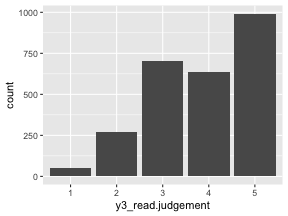

\emini

- Observed factor levels: \"1\", \"2\", \"3\", \"4\", \"5\". 

\fullline

## y5\_grade

*10/11 - School - F2F C4 - Program type*

\bminione

----------------------------------------
Feature                           Result
------------------------- --------------
Variable type                    numeric

Number of missing obs.      117 (4.39 %)

Number of unique values                4

Median                                23

1st and 3rd quartiles             23; 23

Min. and max.                     -9; 24
----------------------------------------

\emini
\bminitwo
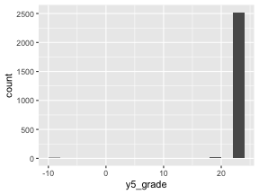

\emini

\fullline

## y5\_math.interest

\bminione

----------------------------------------
Feature                           Result
------------------------- --------------
Variable type                    ordered

Number of missing obs.      158 (5.93 %)

Number of unique values                3

Mode                                 "3"

Reference category                     1
----------------------------------------

\emini
\bminitwo
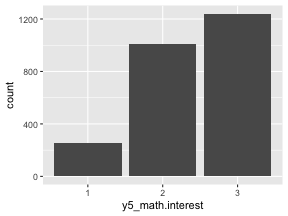

\emini

- Observed factor levels: \"1\", \"2\", \"3\". 

\fullline

## y5\_math.judgement

\bminione

----------------------------------------
Feature                           Result
------------------------- --------------
Variable type                    ordered

Number of missing obs.      149 (5.59 %)

Number of unique values                5

Mode                                 "3"

Reference category                     1
----------------------------------------

\emini
\bminitwo
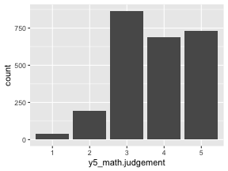

\emini

- Observed factor levels: \"1\", \"2\", \"3\", \"4\", \"5\". 

\fullline

## y5\_read.interest

\bminione

----------------------------------------
Feature                           Result
------------------------- --------------
Variable type                    ordered

Number of missing obs.      158 (5.93 %)

Number of unique values                3

Mode                                 "3"

Reference category                     1
----------------------------------------

\emini
\bminitwo
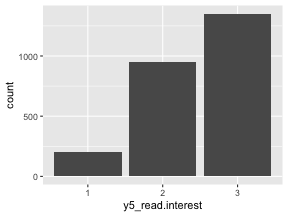

\emini

- Observed factor levels: \"1\", \"2\", \"3\". 

\fullline

## y5\_read.judgement

\bminione

----------------------------------------
Feature                           Result
------------------------- --------------
Variable type                    ordered

Number of missing obs.      156 (5.86 %)

Number of unique values                5

Mode                                 "5"

Reference category                     1
----------------------------------------

\emini
\bminitwo
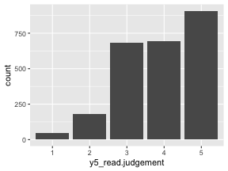

\emini

- Observed factor levels: \"1\", \"2\", \"3\", \"4\", \"5\". 

\fullline

## y7\_math.interest

\bminione

-----------------------------------------
Feature                            Result
------------------------- ---------------
Variable type                     ordered

Number of missing obs.      288 (10.81 %)

Number of unique values                 3

Mode                                  "3"

Reference category                      1
-----------------------------------------

\emini
\bminitwo
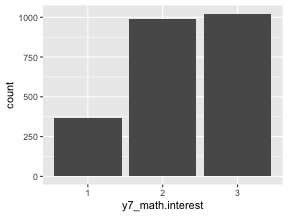

\emini

- Observed factor levels: \"1\", \"2\", \"3\". 

\fullline

## y7\_math.judgement

\bminione

-----------------------------------------
Feature                            Result
------------------------- ---------------
Variable type                     ordered

Number of missing obs.      294 (11.04 %)

Number of unique values                 5

Mode                                  "3"

Reference category                      1
-----------------------------------------

\emini
\bminitwo
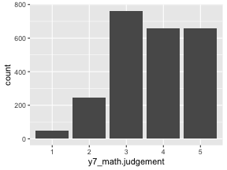

\emini

- Observed factor levels: \"1\", \"2\", \"3\", \"4\", \"5\". 

\fullline

## y7\_read.interest

\bminione

-----------------------------------------
Feature                            Result
------------------------- ---------------
Variable type                     ordered

Number of missing obs.      288 (10.81 %)

Number of unique values                 3

Mode                                  "2"

Reference category                      1
-----------------------------------------

\emini
\bminitwo
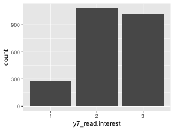

\emini

- Observed factor levels: \"1\", \"2\", \"3\". 

\fullline

## y7\_read.judgement

\bminione

-----------------------------------------
Feature                            Result
------------------------- ---------------
Variable type                     ordered

Number of missing obs.      310 (11.64 %)

Number of unique values                 5

Mode                                  "3"

Reference category                      1
-----------------------------------------

\emini
\bminitwo
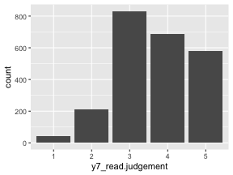

\emini

- Observed factor levels: \"1\", \"2\", \"3\", \"4\", \"5\". 

\fullline

## y3\_math

*naplan - year 3 numeracy*

\bminione

---------------------------------------
Feature                          Result
------------------------- -------------
Variable type                   numeric

Number of missing obs.      65 (2.44 %)

Number of unique values              93

Median                              420

1st and 3rd quartiles          370; 469

Min. and max.                    0; 666
---------------------------------------

\emini
\bminitwo
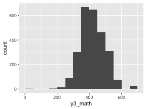

\emini

\fullline

## y5\_math

*naplan - year 5 numeracy*

\bminione

----------------------------------------
Feature                           Result
------------------------- --------------
Variable type                    numeric

Number of missing obs.      153 (5.74 %)

Number of unique values               75

Median                               505

1st and 3rd quartiles       457.4; 556.9

Min. and max.                   0; 798.7
----------------------------------------

\emini
\bminitwo
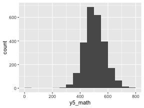

\emini

\fullline

## y7\_math

*naplan - year 7 numeracy*

\bminione

-----------------------------------------
Feature                            Result
------------------------- ---------------
Variable type                     numeric

Number of missing obs.      314 (11.79 %)

Number of unique values                82

Median                              549.6

1st and 3rd quartiles        504.4; 603.5

Min. and max.                354.5; 922.8
-----------------------------------------

\emini
\bminitwo
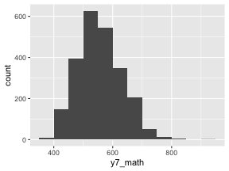

\emini

\fullline

## y3\_read

*naplan - year 3 read*

\bminione

---------------------------------------
Feature                          Result
------------------------- -------------
Variable type                   numeric

Number of missing obs.      67 (2.52 %)

Number of unique values             104

Median                              426

1st and 3rd quartiles          371; 485

Min. and max.                    5; 677
---------------------------------------

\emini
\bminitwo
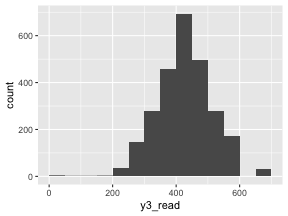

\emini

\fullline

## y5\_read

*naplan - year 5 read*

\bminione

----------------------------------------
Feature                           Result
------------------------- --------------
Variable type                    numeric

Number of missing obs.      133 (4.99 %)

Number of unique values               71

Median                             512.7

1st and 3rd quartiles       454.1; 567.1

Min. and max.                     0; 842
----------------------------------------

\emini
\bminitwo

\emini

\fullline

## y7\_read

*naplan - year 7 read*

\bminione

-----------------------------------------
Feature                            Result
------------------------- ---------------
Variable type                     numeric

Number of missing obs.      308 (11.56 %)

Number of unique values                60

Median                              568.3

1st and 3rd quartiles        516.2; 610.7

Min. and max.                261.4; 785.3
-----------------------------------------

\emini
\bminitwo
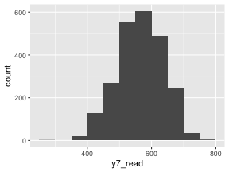

\emini

\fullline

## y3\_status

*naplan - year 3 status*

\bminione

-----------------------------------
Feature                      Result
------------------------- ---------
Variable type               numeric

Number of missing obs.      0 (0 %)

Number of unique values           4

Median                            1

1st and 3rd quartiles          1; 1

Min. and max.                  1; 5
-----------------------------------

\emini
\bminitwo
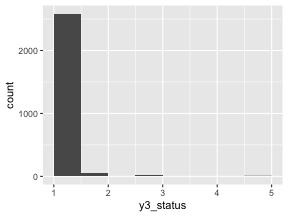

\emini

\fullline

## y5\_status

*naplan - year 5 status*

\bminione

---------------------------------------
Feature                          Result
------------------------- -------------
Variable type                   numeric

Number of missing obs.      70 (2.63 %)

Number of unique values               5

Median                                1

1st and 3rd quartiles              1; 1

Min. and max.                      1; 5
---------------------------------------

\emini
\bminitwo
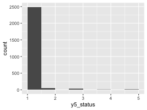

\emini

\fullline

## y7\_status

*naplan - year 7 status*

\bminione

----------------------------------------
Feature                           Result
------------------------- --------------
Variable type                    numeric

Number of missing obs.      236 (8.86 %)

Number of unique values                5

Median                                 1

1st and 3rd quartiles               1; 1

Min. and max.                       1; 5
----------------------------------------

\emini
\bminitwo
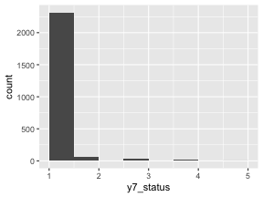

\emini

\fullline

## y3\_sid

*School ID*

\bminione

-------------------------------------------------
Feature                                    Result
------------------------- -----------------------
Variable type                             numeric

Number of missing obs.                    0 (0 %)

Number of unique values                      1639

Median                                 54408884.5

1st and 3rd quartiles       32176027.75; 76707767

Min. and max.                  10139164; 99827483
-------------------------------------------------

\emini
\bminitwo
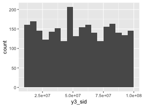

\emini

\fullline

## y3\_math.sch

*Year 3 Numeracy - School's mean NAPLAN scale score*

\bminione

---------------------------------------
Feature                          Result
------------------------- -------------
Variable type                   numeric

Number of missing obs.      26 (0.98 %)

Number of unique values              48

Median                              405

1st and 3rd quartiles          385; 430

Min. and max.                  260; 560
---------------------------------------

\emini
\bminitwo
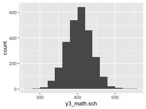

\emini

\fullline

## y3\_read.sch

*Year 3 Reading - School's mean NAPLAN scale score*

\bminione

---------------------------------------
Feature                          Result
------------------------- -------------
Variable type                   numeric

Number of missing obs.      25 (0.94 %)

Number of unique values              49

Median                              410

1st and 3rd quartiles          390; 435

Min. and max.                  200; 535
---------------------------------------

\emini
\bminitwo
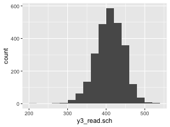

\emini

\fullline

Report generation information:

 *  Created by: Philip Parker (username: `philipparker`).

 *  Report creation time: Fri Jul 03 2020 10:54:29

 *  Report was run from directory: `/Users/philipparker/Dropbox/Projects_Research/IN REVIEW/maternal_judgements`

 *  dataMaid v1.4.0 [Pkg: 2019-12-10 from CRAN (R 3.6.0)]

 *  R version 3.6.1 (2019-07-05).

 *  Platform: x86_64-apple-darwin15.6.0 (64-bit)(macOS Catalina 10.15.3).

 *  Function call: `dataMaid::makeDataReport(data = child_data, mode = c("summarize", 
"visualize", "check"), smartNum = FALSE, file = "/Users/philipparker/Dropbox/Projects_Research/IN REVIEW/maternal_judgements/documentation/2020-07-03_codebook.Rmd", 
    checks = list(character = "showAllFactorLevels", factor = "showAllFactorLevels", 
        labelled = "showAllFactorLevels", haven_labelled = "showAllFactorLevels", 
        numeric = NULL, integer = NULL, logical = NULL, Date = NULL), 
    listChecks = FALSE, maxProbVals = Inf, codebook = TRUE, reportTitle = "Codebook for child_data")`

